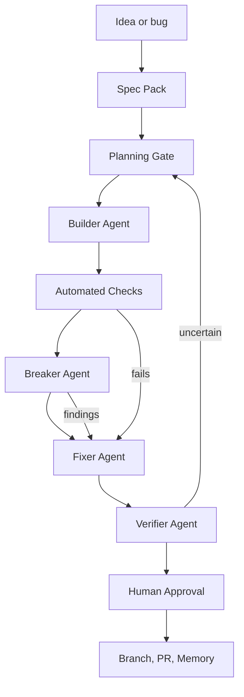

# AI Development Quality Pipeline

Date: 2026-05-27

Purpose: help Lana keep building without accidentally creating a brittle codebase. This pipeline assumes Lana is not trying to become "the developer of record" for every line of code. The system should make agents produce clearer specs, smaller changes, stronger tests, and multiple forms of review before anything is trusted.

## Guiding Principle

AI-assisted development should run as supervised autonomy:

1. Define the contract before code.
2. Let one agent build.
3. Let another agent break/review.
4. Let a third pass verify against tests, accessibility, design tokens, privacy, and repo conventions.
5. Let Lana approve product/design intent, risk, and tradeoffs.

The goal is not to slow work down. The goal is to prevent "it works in the demo" from becoming the foundation.

## Default Pipeline



## Gates

| Gate | Owner | Output | Stop condition |
|---|---|---|---|
| Spec Pack | Product/Design Architect | Goal, non-goals, constraints, acceptance criteria, a11y/privacy requirements | Ambiguous behavior, hidden assumptions, or no acceptance criteria |
| Planning Gate | Architecture Reviewer | Files likely touched, existing patterns to preserve, test strategy | Scope too large or touches risky shared code without review |
| Build | Builder Agent | Small implementation diff | Agent changes unrelated files or invents new patterns |
| Automated Checks | Tooling | Typecheck/lint/tests/build/verify scripts | Any failing command without explanation |
| Break | Adversarial Reviewer | Bugs, missing states, weak tests, accessibility and security concerns | P1/P2 finding or false confidence |
| Fix | Fixer Agent | Minimal patch responding to findings | Fix expands scope or hides failure |
| Verify | Independent Verifier | Re-run checks, browser/visual QA when relevant, final risk summary | Not actually verified or important unknowns remain |
| Ship | Release Assistant | Branch, commit, PR, concise summary | Dirty unrelated work, local-only paths, missing review notes |

## Agentic Roles

| Role | Best model/tool | Responsibility |
|---|---|---|
| Product/Design Architect | GPT-5.4 or Codex high reasoning | Turns messy intent into a spec contract and acceptance criteria |
| Repo Cartographer | Codex | Reads existing code first and identifies local conventions |
| Builder | Codex | Implements the smallest coherent change |
| Breaker | Claude/Codex alternate model | Reviews for bugs, edge cases, regressions, accessibility, and maintainability |
| Test Author | Codex or Gemini | Adds tests that prove the behavior, especially edge cases |
| Visual QA | Browser/Playwright | Opens the app, screenshots flows, checks responsive and interactive states |
| Compliance Guard | design-accessibility, token-audit, design-system-guard | Blocks accessibility, token, or regulated-product quality failures |
| Ship Captain | branch-push-pr/GitHub | Moves clean work to a branch and PR with the right summary |
| Memory Curator | OpenBrain | Saves decisions, proof points, and recurring lessons |

Use model disagreement deliberately. If the builder and reviewer are the same model family, route high-risk work to a second model for counter-analysis before trusting it.

## Minimum Quality Commands

Every repo should expose one command that represents "is the system still healthy?" For this repo, the closest existing command is:

```bash
npm run verify
```

For active application/frontend repos, the quality gate should usually include:

```bash
npm run typecheck
npm run lint
npm test
npm run build
```

For frontend UI work, add browser verification:

```bash
npm run dev
# Browser/Playwright: open the changed route, screenshot desktop + mobile, test the main interaction
```

For design-system work, add:

```text
token-audit
design-accessibility
responsive-audit
api-consistency-audit
design-system-guard
package-validator before publish/tarball
```

## Spec Pack Template

Create this before the agent builds anything non-trivial:

```markdown
# SPEC

## Goal

## Non-goals

## User impact

## Constraints
- Existing patterns to preserve:
- Files/modules likely in scope:
- Files/modules out of scope:

## Acceptance criteria
- [ ] 
- [ ] 
- [ ] 

## Accessibility and privacy
- Keyboard:
- Screen reader:
- Contrast/focus:
- Data/privacy:

## Test plan
- Unit:
- Integration:
- Visual/browser:
- Manual:

## Review rubric
- What would make this unsafe to ship?
- What would count as over-engineering?
- What assumptions must be verified?
```

## Local Skill Coverage

Source registry: `/Users/lanaholston/Desktop/SKILLS GIT/manifest.json`

Current source registry has 39 skills. The active local Codex skill folder at `/Users/lanaholston/.agents/skills` has 28 user skills, plus this repo contributes `career-ops`. The AGENTS instructions still say 32 custom skills, so the published count is stale.

Strong coverage already exists:

| Need | Covered by |
|---|---|
| Start/end hygiene | `start-work`, `end-work` |
| Shipping/PR flow | `branch-push-pr` |
| Multi-agent build/review/fix loop | `agent-loop` |
| Cross-model orchestration | `multi-llm-orchestrator` |
| Pre-commit token/a11y/code scan | `pre-commit-audit` |
| Frontend implementation | `frontend-design`, `source-command-frontend-design` |
| Responsive review | `responsive-audit` |
| API consistency | `api-consistency-audit` |
| Design tokens | `token-audit`, `brand-tokens-translator`, `theme-generator` |
| Accessibility | `design-accessibility` |
| Edge states | `ui-edge-case-audit` |
| Design-system final QA | `design-system-guard`, `package-validator` |
| Skill-system review | `skill-audit` |
| Persistent memory | OpenBrain protocol |
| Career-ops local integrity | `career-ops`, `npm run verify`, `dedup`, `normalize`, `merge` |

Important gaps:

| Gap | Why it matters | Proposed primitive |
|---|---|---|
| Spec-first coding gate | Agents can build before requirements are stable | New `/dev-spec` slash command or `spec-pack` skill |
| Repo-wide quality gate | Current checks are scattered by repo and skill | New `/quality-gate` command that discovers and runs typecheck/lint/test/build/verify |
| Independent test author | Reviews catch bugs, but tests prevent repeat bugs | New `test-plan-generator` or `test-author` skill |
| Architecture/deep-module review | Prevents shallow fixes from accumulating into a house of cards | New `architecture-review` skill, revived from prior deferred idea |
| Dependency/docs freshness | Agents can use outdated API knowledge | Add a `context7-docs-check` step to spec/build work |
| Security/privacy review | Career and Metrc-adjacent work can involve sensitive data | New `privacy-security-audit` skill |
| Visual regression workflow | UI can pass code review while looking broken | New `/visual-qa` command using Browser/Playwright screenshots |
| Agent-loop path drift | Existing skill points to `/Users/lanaholston/Desktop/OpenBrain/...`, but the current path is `/Users/lanaholston/Code/OpenBrain/...` | Update `agent-loop` skill after approval |
| Codex deployment drift | Manifest and active local skills do not line up cleanly | Run `skill-sync` after deciding which skills should be active in Codex |

## Recommended New Primitives

### Slash Commands

| Command | Job |
|---|---|
| `/dev-spec` | Turn a request into a spec pack before coding starts |
| `/quality-gate` | Run all repo-appropriate checks and summarize pass/fail |
| `/agent-loop` | Run build-break-fix for implementation work |
| `/visual-qa` | Browser screenshots and interaction checks after UI changes |
| `/architecture-review` | Review whether the change deepens or weakens the codebase |
| `/ship-check` | Final dirty-tree, local-path, tests, branch, PR checklist |

### Skills

| Skill | Purpose |
|---|---|
| `spec-pack` | Creates SPEC.md/ACCEPTANCE.md/REVIEW.md style contracts |
| `quality-gate` | Detects package manager and runs canonical checks |
| `test-author` | Adds meaningful tests for new behavior and regressions |
| `architecture-review` | Flags brittle coupling, wrong abstraction, and shallow module boundaries |
| `privacy-security-audit` | Checks secrets, data exposure, local-only paths, and sensitive-domain risk |
| `visual-qa` | Uses Browser/Playwright screenshots across desktop/mobile |

### Plugins and Tools

| Tool | Use |
|---|---|
| OpenBrain | Recall prior decisions before non-trivial work; remember significant outcomes |
| context7 | Pull current docs for libraries/frameworks before implementation |
| Browser or Playwright | Verify local UI instead of trusting static code review |
| GitHub | PR review, CI checks, unresolved comments |
| Codex/Claude/Gemini mix | Builder/reviewer/verifier separation |

## Default Prompts

Start work:

```text
Before coding, create a spec pack. Read the repo first. Identify existing patterns, risks, tests to run, and acceptance criteria. Do not implement until the spec is clear.
```

Builder:

```text
Implement only the approved spec. Keep the diff small. Follow existing local patterns. Add or update tests for changed behavior. Do not refactor unrelated code.
```

Breaker:

```text
Review this as if you are trying to prevent a brittle codebase. Prioritize bugs, missing tests, accessibility, hidden coupling, stale docs/API assumptions, and places where the implementation merely works by accident.
```

Verifier:

```text
Re-run the quality gate. Verify the acceptance criteria one by one. For UI, open it in Browser/Playwright and check desktop and mobile. Separate verified facts from assumptions.
```

## Suggested Adoption Order

1. Fix the `agent-loop` path drift so the existing Build-Break-Fix primitive is trustworthy.
2. Add `/dev-spec` or `spec-pack`; this is the highest-leverage house-of-cards prevention.
3. Add `/quality-gate`; make one command the default proof that a repo is still healthy.
4. Add `test-author`; require tests before non-trivial behavior changes are considered done.
5. Add `/visual-qa` for frontend work.
6. Add `architecture-review` for shared modules, design-system primitives, and anything that feels "clever."
7. Add `privacy-security-audit` for career data, regulated-domain work, forms, scraping, and integrations.

## Operating Rule

For trivial edits, use judgment. For anything that changes behavior, public UI, data, application flow, design-system primitives, or automation:

```text
Spec -> Build -> Automated checks -> Break -> Fix -> Verify -> Ship
```

No single agent should both build and declare the work safe without independent review.
